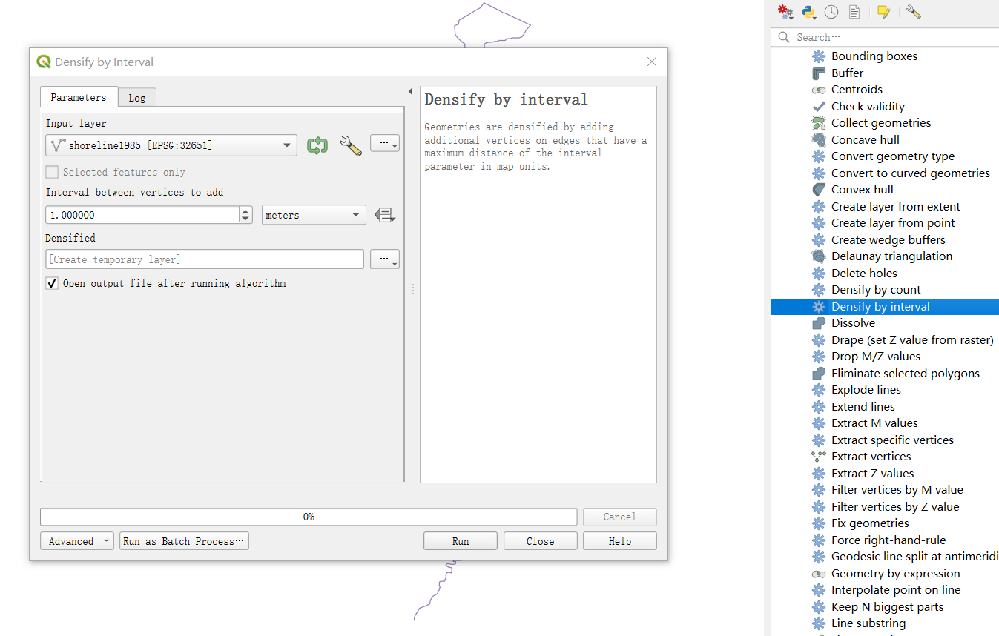
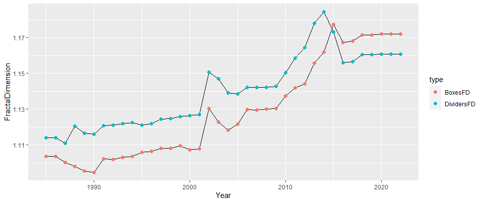
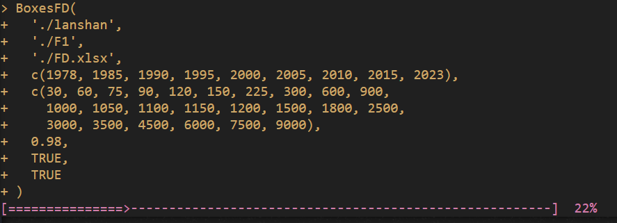

# [English](English.md) [中文](README.md)

<a href="https://www.r-project.org/" target="_blank">
    
</a>
<a href="https://posit.co/download/rstudio-desktop/" target="_blank">
    
</a>
<a href="https://qgis.org/en/site/" target="_blank">
    
</a>

<div align="center">
    
<br>
CoastlineFD
<br>
<a href="https://mirrors.tuna.tsinghua.edu.cn/CRAN/web/packages/CoastlineFD/index.html" target="_blank">CRAN</a> / <a href="https://github.com/redworld123/CoastlineFD" target="_blank">GitHub</a>
<br>
Calculating the fractal dimension of a coastline using the boxes and dividers methods
</div>

[](#contents)
[](#Download-)
[](#Function-)
[](#Example-)
[](#Interface-)
[](#Other-)

> New user?  
>
> Frequent use of `help(package='CoastlineFD')` is recommended  

# Download [](#Downlaod-)

```
# CRAN
install.package('CoastlineFD')

# GitHub
library('devtools')
install_github("redworld123/CoastlineFD")
```

# Function [](#Function-)

- Boxes method for calculating fractal dimension
- Dividers method for calculating fractal dimension
- Boxes and dividers method together to calculate fractal dimension
- Plotting the time series of calculation results
- Exporting calculation results as `.xlsx`

# Example [](#Example-)

### 量规法

> Shoreline vector data needs to be topologically checked to ensure that each phase of the shoreline is a complete straight line, with no breaks or self-intersections.  
> Shoreline vector data must be densified, it is recommended to use `QGIS` to densify shoreline vector file point number strings at `1m` intervals.  

<div align="center">
    
</div>

> Calculate the Dividers method fractal dimension separately using the `DividersFD()` function  

```
DinputPath = './DividersFD'                     # where multiple phases of shoreline vector files are placed
outputPath = './FD.xlsx'                        # Location of results export
year = c(1985:2023)                             # Starting and ending years for multi-phase shorelines
r = c(                                          # Scale of the divider
    30, 60, 75, 90, 150, 200, 300, 400,
    500, 600, 700, 800, 900, 1000, 1050,
    1100, 1150, 1200, 1300, 1400, 1500,
    1650, 1800, 2500, 3000, 3500, 4500,
    6000, 7500, 9000
)
pearsonValue = 0.98                             # Pearson's coefficient
writeF = TRUE                                   # Whether to export results to .xlsx file
showF = TRUE                                    # Whether or not to graph the results

DividersFD(
    DinputPath,
    outputPath,
    year,
    r,
    pearsonValue,
    FALSE,
    TRUE
)
```

### 网格法

> It is recommended to use `QGIS` to generate sampling grids close to the study area; different ranges of grids will lead to different results in the calculation of the fractal dimension of the grid method  
> Shoreline vector data needs to be topologically checked to ensure that each phase of the shoreline is a complete straight line, with no breaks or self-intersections  
> No need for solid densification, which greatly increases the computational time of the grid method.  
> Calculate the boxes method fractal dimension separately using the `BoxesFD()` function  

```
BinputPath = './BoxesFD'                        # where multiple phases of shoreline vector files are placed
Fishnet = './Fishnet'                           # where multiple scales of grids are placed
outputPath = './FD.xlsx'                        # Location of results export
year = c(1985:2023)                             # Starting and ending years for multi-phase shorelines
r = c(                                          # Scale of the grid
    30, 60, 75, 90, 150, 200, 300, 400,
    500, 600, 700, 800, 900, 1000, 1050,
    1100, 1150, 1200, 1300, 1400, 1500,
    1650, 1800, 2500, 3000, 3500, 4500,
    6000, 7500, 9000
)
pearsonValue = 0.98                             # Pearson's coefficient
writeF = TRUE                                   # Whether to export results to .xlsx file
showF = TRUE                                    # Whether or not to graph the results

BoxesFD(
    BinputPath,
    Fishnet,
    outputPath,
    year,
    r,
    pearsonValue,
    FALSE,
    TRUE
)
```

### 网格法和量规法

> Note all the above hints and use the `FD()` function to calculate both at the same time  

```
DinputPath = './DividersFD'                     # in which the vector file of the densified multi-phase shoreline is placed
BinputPath = './BoxesFD'                        # in which to place the vector file of the unfiltered multi-phase shoreline
Fishnet = './Fishnet'                           # where multiple scales of fishnet are placed
outputPath = './FD.xlsx'                        # Location of results export
year = c(1985:2023)                             # Starting and ending years for multi-phase shorelines
r = c(                                          # scales
    30, 60, 75, 90, 150, 200, 300, 400,
    500, 600, 700, 800, 900, 1000, 1050,
    1100, 1150, 1200, 1300, 1400, 1500,
    1650, 1800, 2500, 3000, 3500, 4500,
    6000, 7500, 9000
)
pearsonValue = 0.98                             # Pearson's coefficient
writeF = TRUE                                   # Whether to export results to .xlsx file
showF = TRUE                                    # Whether or not to graph the results

FD(
    DinputPath,
    BinputPath,
    Fishnet,
    outputPath,
    year,
    r,
    pearsonValue,
    FALSE,
    TRUE
)
```

> Running Result Chart  

<div align="center">
    
</div>

# Interface [](#Interface-)

> Just wait patiently for the progress bar to finish  

<div align="center">
    
</div>

# Other [](#Other-)

> reference  

- How Long Is the Coast of Britain? Statistical Self-Similarity and Fractional Dimension
- Fractal dimension of coastline of Australia

> Sample data  

- The `R` package help file carries a limited amount of data to perform a complete calculation of the fractal dimension, which can be obtained in the `example` folder  

***
