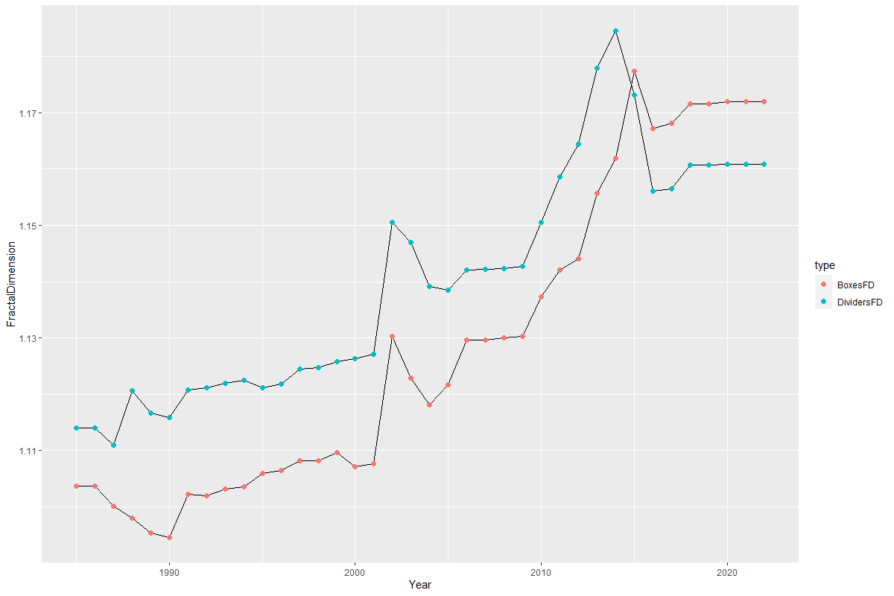

# Description

A system is used to calculate the fractal dimension of coastline by boxes method and Dividers method.

# Installation

```R
install.packages("CoastlineFD")
devtools::install_github("CoastlineFD")
```
# Example

- BoxesFD
- DividersFD
- Fishnet
- *.R

```R
library("CoastlineFD")

FD(
  "./Dividers",
  "./Boxes",
  "./Fishnet",
  "./FD.xlsx",
  c(1985:2022),
  c(30, 60, 75, 90, 150, 200, 300, 400, 500, 
    600, 700, 800, 900, 1000, 1050, 1100, 1150,
    1200, 1300, 1400, 1500, 1650, 1800, 2500, 3000,
    3500, 4500, 6000, 7500, 9000),
  0.99,
  TRUE,
  TRUE
)
```

# Detial

- When calculating the fractal dimension of dividers method, you need to density the shoreline data first.
- You can use the QGIS toolkit to perform this operation in batches.


# Results


