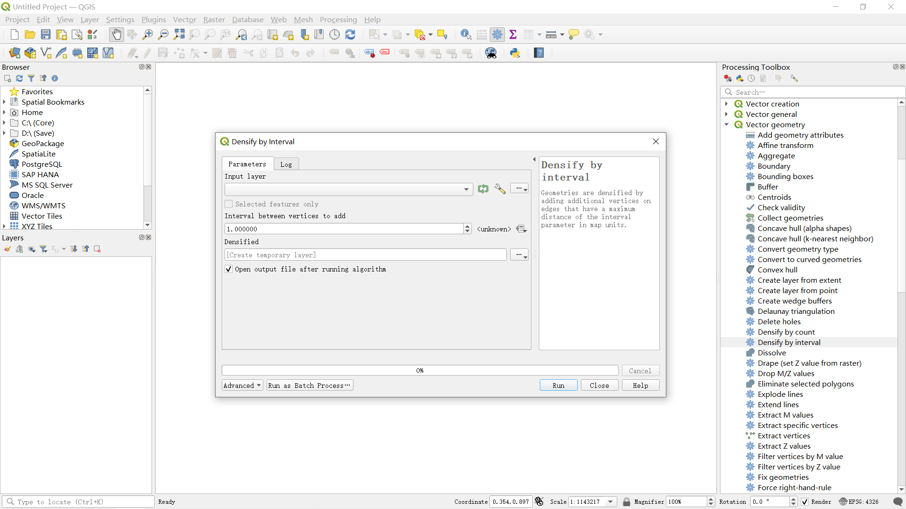

# CoastlineFD

The goal of CoastlineFD is to calculate the fractal dimension of coastline by boxes method and Dividers method.

## Installation

You can install the development version of CoastlineFD like so:

``` r
devtools::github_install("redworld123/CoastlineFD")
```

## Example

This is a basic example which shows you how to solve a common problem:

``` r
library("CoastlineFD")

FD(
  "./DividersFD",
  "./BoxesFD",
  "./Fishnet",
  "./FD.xlsx",
  c(1985:2022),
  c(30, 60, 75, 150, 300, 600, 900, 1000, 1050, 1100, 1150, 1200, 1500, 1800, 2500, 3000, 3500, 4500, 6000, 7500, 9000),
  0.90,
  TRUE
)
```

## Recommended directory form

- BoxesFD
  - *.shp
- DividersFD
  - *.shp
- Fishnet
  - *.shp
- *.r

## Pay attention

<p style = "test-align:justfiy; text-justfiy: inter-ideograph">In directory named BoxesFD, you had better not use line with density. In directory named DividersFD, you must densify line shapefiles by QGIS tools at first, recommended interval parameters 1.000000. In addition, the appropriate amount of files should be topologically checked to ensure that there are no suspension points, self-intersecting points, breakpoints, etc</p>



# Common research scales in China, unit meter

- 30
- 60
- 75
- 150
- 300
- 600
- 900
- 1000
- 1050
- 1100
- 1150
- 1200
- 1500
- 1800
- 2500
- 3000
- 3500
- 4500
- 6000
- 7500
- 9000
