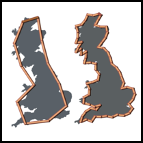

# [中文](README.md) [English](English.md)

<a href="https://www.r-project.org/" target="_blank">
    
</a>&nbsp;
<a href="https://posit.co/download/rstudio-desktop/" target="_blank">
    
</a>

<div align="center">

<br>
CoastlineFD / 海岸线分形维数计算
<br>
<a href="https://mirrors.tuna.tsinghua.edu.cn/CRAN/web/packages/CoastlineFD/index.html" target="_blank">CRAN</a> / <a href="https://github.com/redworld123/CoastlineFD" target="_blank">GitHub</a>
<br>
使用量规法和网格法计算海岸线的分形维数
</div>

[](#contents)
[](#Download-下载方法-)
[](#Function-主要功能-)
[](#Example-操作范例-)
[](#Other-其他-)
[](#Grateful-感谢-)
[](#Interface-界面-)

> 新用户？  
>
> 建议频繁使用`help(package=‘CoastlineFD’)`  

# Download-下载方法 [](#Downlaod-下载方法-)
[English](English.md)

```
# CRAN
install.package('CoastlineFD')

# GitHub
library('devtools')
install_github("redworld123/CoastlineFD")
```

# Function-主要功能 [](#Function-主要功能-)
[English](English.md)

- 网格法计算分形维数
- 量规法计算分形维数
- 网格法和量规法共同计算分形维数
- 绘制计算结果时序图
- 导出计算结果为`.xlsx`

# Example-操作范例 [](#Example-操作范例-)
[English](English.md)

