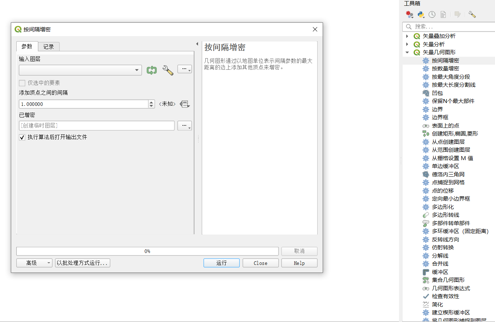

# [中文](README.md) [English](English.md)

<a href="https://www.r-project.org/" target="_blank">
    
</a>&nbsp;
<a href="https://posit.co/download/rstudio-desktop/" target="_blank">
    
</a>

<div align="center">

<br>
CoastlineFD / 海岸线分形维数计算
<br>
<a href="https://mirrors.tuna.tsinghua.edu.cn/CRAN/web/packages/CoastlineFD/index.html" target="_blank">CRAN</a> / <a href="https://github.com/redworld123/CoastlineFD" target="_blank">GitHub</a>
<br>
使用量规法和网格法计算海岸线的分形维数
</div>

[](#contents)
[](#Download-下载方法-)
[](#Function-主要功能-)
[](#Example-操作范例-)
[](#Interface-运行界面-)
[](#Other-其他-)
[](#Grateful-感谢-)

> 新用户？  
>
> 建议频繁使用`help(package=‘CoastlineFD’)`  

# Download-下载方法 [](#Downlaod-下载方法-)
[English](English.md)

```
# CRAN
install.package('CoastlineFD')

# GitHub
library('devtools')
install_github("redworld123/CoastlineFD")
```

<a href="#readme">
    
</a>

# Function-主要功能 [](#Function-主要功能-)
[English](English.md)

- 网格法计算分形维数
- 量规法计算分形维数
- 网格法和量规法共同计算分形维数
- 绘制计算结果时序图
- 导出计算结果为`.xlsx`

<a href="#readme">
    
</a>

# Example-操作范例 [](#Example-操作范例-)
[English](English.md)

### 量规法

> 海岸线矢量数据需要进行拓扑检查，确保每期岸线均为一条完整直线，不存在断点和自相交  
> 海岸线矢量数据必须进行实密化处理，建议使用`QGIS`以`1m`间隔增密岸线矢量文件点号串  

<div align="center">
    
</div>

> 使用`DividersFD()`函数单独计算量规法分形维数  

```
DinputPath = './DividersFD'                     # 其中放置多期岸线矢量文件
outputPath = './FD.xlsx'                        # 结果导出的位置
year = c(1985:2023)                             # 多期岸线的起止年份
r = c(                                          # 量规的尺度
    30, 60, 75, 90, 150, 200, 300, 400,
    500, 600, 700, 800, 900, 1000, 1050,
    1100, 1150, 1200, 1300, 1400, 1500,
    1650, 1800, 2500, 3000, 3500, 4500,
    6000, 7500, 9000
)
pearsonValue = 0.98                             # 皮尔森系数
writeF = TRUE                                   # 是否将结果导出到.xlsx文件
showF = TRUE                                    # 是否绘制结果图

DividersFD(
    DinputPath,
    outputPath,
    year,
    r,
    pearsonValue,
    FALSE,
    TRUE
)
```

### 网格法

> 建议使用`QGIS`紧贴研究区域生成采样网格，不同范围的网格会导致网格法分形维数计算结果的不同  
> 海岸线矢量数据需要进行拓扑检查，确保每期岸线均为一条完整直线，不存在断点和自相交  
> 无需实密化处理，该处理会极大增加网格法的计算时间  
> 使用`BoxesFD()`函数单独计算网格法分形维数  

```
DinputPath = './BoxesFD'                        # 其中放置多期岸线矢量文件
outputPath = './FD.xlsx'                        # 结果导出的位置
year = c(1985:2023)                             # 多期岸线的起止年份
r = c(                                          # 量规的尺度
    30, 60, 75, 90, 150, 200, 300, 400,
    500, 600, 700, 800, 900, 1000, 1050,
    1100, 1150, 1200, 1300, 1400, 1500,
    1650, 1800, 2500, 3000, 3500, 4500,
    6000, 7500, 9000
)
pearsonValue = 0.98                             # 皮尔森系数
writeF = TRUE                                   # 是否将结果导出到.xlsx文件
showF = TRUE                                    # 是否绘制结果图

BoxesFD(
    BinputPath,
    outputPath,
    year,
    r,
    pearsonValue,
    FALSE,
    TRUE
)
```

### 网格法和量规法

> 注意上述所有提示，使用`FD()`函数同时计算两者  

```
DinputPath = './BoxesFD'                        # 其中放置多期岸线矢量文件
outputPath = './FD.xlsx'                        # 结果导出的位置
year = c(1985:2023)                             # 多期岸线的起止年份
r = c(                                          # 量规的尺度
    30, 60, 75, 90, 150, 200, 300, 400,
    500, 600, 700, 800, 900, 1000, 1050,
    1100, 1150, 1200, 1300, 1400, 1500,
    1650, 1800, 2500, 3000, 3500, 4500,
    6000, 7500, 9000
)
pearsonValue = 0.98                             # 皮尔森系数
writeF = TRUE                                   # 是否将结果导出到.xlsx文件
showF = TRUE                                    # 是否绘制结果图

BoxesFD(
    BinputPath,
    outputPath,
    year,
    r,
    pearsonValue,
    FALSE,
    TRUE
)
```

<a href="#readme">
    
</a>

